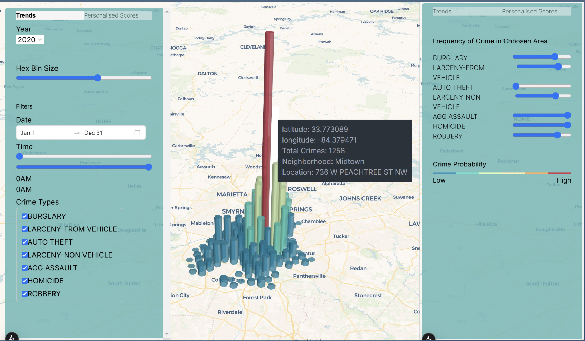
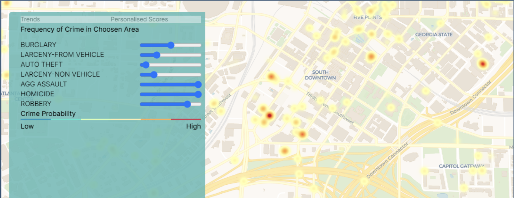

# CrimeMap Atlanta

## Description
CrimeMap Atlanta is a Next.js (React-based framework) program. It is an interactive application designed to assist residents and prospective renters in making informed and safer housing decisions by providing area-specific crime data. The application visualizes crime data spatially and temporally and provides users with customizable crime scores. These scores are based on crime type and other user-defined criteria, offering a comprehensive safety profile tailored to user preferences for each neighborhood.

Users can filter the crime data and visualization in various ways, such as by Year, Date, Time, and Crime Types. Additionally, users can adjust the weights of the seven different Crime Types. The unique filtering and weighting of crime subtypes enable users to assess specific crime types they consider acceptable over others, allowing them to make wise, personalized, and informed neighborhood choices.

## Motivation
Most people generally rent off-campus housing in Atlanta. As a non-native resident, one major factor that I (and even my other friends) considered when choosing an apartment was the nearby crime levels.

The aim of developing CrimeMap Atlanta is to assist residents and prospective renters in making informed and safer housing decisions by providing area-specific crime data. The application visualizes crime data spatially and temporally and provides users with customizable crime scores. These scores are based on crime type and other user-defined criteria, offering a comprehensive safety profile tailored to user preferences for each neighborhood. The unique filtering and weighting of crime subtypes enable users to assess specific crime types they consider acceptable over others, allowing them to make personalized, informed choices.

**Primary users** include prospective tenants, current residents, and home buyers in Atlanta. **Secondary users** would be urban planners and law enforcement agencies. Renters and home buyers can use the application to prioritize safety in housing decisions, while planners and law enforcement can allocate resources effectively based on crime patterns. Additionally, studies have found that crime and housing prices have an inverse relationship.

## Data
The dataset used in this project comes from the **Atlanta Police Department’s (APD) Open Data Portal**, which can be downloaded here: [Crime Data](https://services3.arcgis.com/Et5Qfajgiyosiw4d/arcgis/rest/services/2009_2020CrimeData/FeatureServer/replicafilescache/2009_2020CrimeData_2319764293480411244.csv).

The original CSV is **73 MB** and contains **366,824 data points** and **22 variables**. The data is temporal and contains various information about crimes reported by the Atlanta PD, including but not limited to:

- **Report Number** - Unique ID for each crime offense.
- **Report Date** - Date the crime was reported by the APD from 1/1/2009 to 12/31/2020.
- **Occur Date** - (Potential) date the crime occurred.
- **Crime Type** - Broad categories for types of offenses (e.g., Aggravated assault).
- **NIBRS Code** - National Incident-Based Reporting System code corresponding with specific offenses (e.g., 270 = Embezzlement).
- **Location** - (Approximate) address of the crime.
- **Longitude** - (Approximate) longitude of the crime.
- **Latitude** - (Approximate) latitude of the crime.

**Variables in bold are used in our program.**

## Key Approaches
### 3D Visualization
CrimeMap Atlanta displays a **3D hexagonal heatmap** to represent crime locations instead of 2D. We found that it is easier to immediately comprehend and compare locations using this approach rather than a table or labels.

### Weight Customization
CrimeMap Atlanta calculates scores for smaller subzones, represented by hexbins, within Atlanta neighborhoods. This is done using the **longitude and latitude** data from the dataset and creating a **hexagon-based heatmap** with the data. Users can filter these scores by **date range and time** and adjust the **weights of the seven crime types** to match their safety priorities. The size of the hexbins can also be changed. The scores are calculated from the filtered data using **Kernel Density Estimation (KDE)** so that users can consider a larger, specified area rather than a single location.

### Kernel Density Estimation (KDE)
CrimeMap Atlanta utilizes **Kernel Density Estimation (KDE)** to score geographic areas of Atlanta. KDE is a **nonparametric smoothing model** used for estimating probability distributions. KDE is useful for creating **continuous visualizations from point data** and works well for identifying spatial patterns, such as outliers. In CrimeMap Atlanta, we opted to use **Gaussian KDE** due to its ability to smooth data and reduce random errors caused by approximate location reporting.

## Installation
1. Extract the `CODE` folder.
2. Download the dataset from:  
   [Crime Data CSV](https://services3.arcgis.com/Et5Qfajgiyosiw4d/arcgis/rest/services/2009_2020CrimeData/FeatureServer/replicafilescache/2009_2020CrimeData_2319764293480411244.csv).
3. Move the dataset CSV to the `public` folder inside the `CODE` folder.
4. Download **Node.js** from [Node.js Download](https://nodejs.org/en/download/prebuilt-installer). You may need to restart your computer afterward.
5. Open **Command Prompt**.
6. Navigate to the `public` folder inside the `CODE` folder and run the data cleaning script:
   ```sh
   py dataCleaning.py
   ```
7. Navigate back to the `CODE` folder and install dependencies:
   ```sh
   npm install
   ```

## Execution
1. From the `CODE` folder, run:
   ```sh
   npm run dev
   ```
2. Open **[http://localhost:3000](http://localhost:3000)** in your browser to see the application.

## Screenshots
Landing Page:


Prediction Tab:


---
This project aims to empower individuals to make safer and well-informed housing decisions in Atlanta through advanced visualization and analysis of crime data. 🚀
